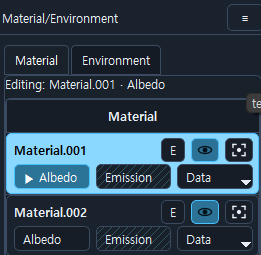

# 델피아 3D 페인터 위키

---

## **본 툴은 레이어 기반의 3D 손맵 텍스쳐 페인팅 툴입니다.**

---

### **지원되는 포맷 - obj, fbx**

- 델피아 3D 페인터는 obj, fbx 파일만을 불러올 수 있으며, glb/gltf 형식은 트라이앵글 데이터만을 담고 있기에 쿼드, ngon 데이터를 유지할 수 없어 마스킹 작업 시 불편함을 초래합니다. 따라서 glb/gltf는 지원 대상에서 제외하게 되었습니다.

---

### **메테리얼별 캔버스 슬롯 (알베도, 이미션, 메탈릭, 러프니스, AO)**

  

- 불러온 모델의 메테리얼 데이터를 읽어 각 메테리얼 별로 알베도, 이미션, 데이터(메탈릭, 러프니스, AO) 슬롯이 생성됩니다. 각 슬롯에는 캔버스를 할당할 수 있으며, 캔버스에는 레이어 데이터가 포함됩니다. 데이터에 해당하는 캔버스들은 회색조인 8bit 색상으로만 표시됩니다.

- 메인 색상을 작업할 슬롯은 알베도, 이미션 둘 중 원하는 곳에 작업해도 상관없지만, 권장하는 슬롯은 알베도입니다. 베이스 컬러를 알베도 슬롯 캔버스에 작업하는 걸 기본 전제로 고려하여 작업하였습니다. 메테리얼 패널의 환경 탭에서 블룸을 조절할 수 있는데, 이미션 캔버스는 이 블룸에 영향받는 광원 캔버스로 동작합니다. (블룸은 미리보기용으로 렌더할 엔진과는 다르게 보일 수 있습니다.)

- ^^데이터(메탈릭, 러프니스, AO) 맵 슬롯들은 디테일한 작업을 위해 존재하는 건 아닙니다.^^ 각 캔버스로 진입하면 메탈릭과, 러프니스는 알베도 슬롯의 캔버스를 기반으로 회색이미지를 뽑아냅니다. 추출 시점에 간단한 색 조정이 가능하며, 마스킹을 통해 금속, 비금속을 구분시키는 등의 작업을 고려한 슬롯입니다. - ^^현재 기능은 적용되어 있으나, 좋은 결과물을 얻기에는 부족할 수 있습니다.^^

---

### **레이어 방식**
- 본 프로그램은 레이어 구조를 통한 페인팅 방식을 지원합니다. 
- 레이어는 채우기 레이어, 래스터 레이어 크게는 이 두 가지 방식으로 나뉩니다. 다만, 베이킹 텍스쳐, 로드한 이미지, 텍스쳐 프리셋을 삽입하는 것도 지원하는데 이 때 모든 삽입 텍스쳐는 래스터 레이어로 들어가게 됩니다.
- 레이어 그룹을 지원합니다(트라이얼 버전은 사용 불가)
- 레이어 블렌딩 모드를 지원합니다.
- 투명 픽셀 잠금, 잠금, 가시성 토글 기능을 지원합니다.
- 레이어 마스크 기능을 지원합니다.

---

### **ORA(OpenRaster Format) 내보내기, 가져오기**

- .ora 포맷은 간단히 말하면, .psd를 대체하기 위해 만들어진 레이어 이미지 포맷이라고 보시면 됩니다. 이를 지원하는 툴은 Krita, Gimp 등이 있습니다.
    자세한 내용은 이 링크를 참조하세요. [OpenRaster 위키피디아](https://en.wikipedia.org/wiki/OpenRaster)
- 델피아 3D 페인터는 현재 작업중인 레이어 데이터를 .ora 포맷으로 내보내 krita 같은 툴에서 편집해서 다시 가져와, 현재 레이어들을 덮어쓰거나, ora의 레이어들을 그룹으로 묶어 현재 레이어의 최상단에 배치할 수 있습니다.

---

### **페인팅 : 2D + 3D 작업 뷰포트와 페인팅을 위한 도구들(브러시, 지우개, 선택, 채우기-그라데이션)**

- 본 프로그램은 2D와 3D 환경 모두에서
    페인팅을 할 수 있게 설계되었습니다.
- 브러시(B) 와 지우개(E) 는 사이즈, 간격, 하드니스, 각도, 둥글기, 살포 범위 및 밀도, 필압 사이즈, 필압 불투명도 여부, 텍스쳐 브러시 팁, 안티에일리어싱 여부를 설정 가능합니다. 커스텀한 설정을 브러시 프리셋으로 저장하는 것도 가능합니다.
- 선택 툴(L,M,P)은 커서의 위치가 2D 뷰포트에 있는가, 3D 뷰포트에 있는가에 따라 조금 다르게 동작합니다. 2D에서는 올가미, 사각형, 꺾은 선 선택 툴을 고를 수 있으며, 3D에서는 페이스, 올가미, 사각형으로 이름은 비슷하지만, 3D에서는 선택한 영역과 겹치는 모든 면을 선택하는 방식으로 작동합니다. 즉 올가미나 사각형으로 그린 모양으로 선택 범위가 지정되는 것이 아닌 겹친 면들이 선택되는 방식입니다.
- 채우기 툴(G)은 일반 채우기와 그라데이션 채우기 이 두 가지 방식으로 작동합니다. 또한, 커서가 2D와 3D 뷰포트 중 어디에 있는가에 따라 마찬가지로 동작방식이 약간 달라집니다. 일단 일반 채우기 기능은 클릭 한 번으로 동작합니다. 2D 뷰에서는 실제 픽셀 기반으로 채울 영역을 검사하고 채우는 flood fill 방식으로 동작합니다. 3D에서는 트라이앵글, 면, 메쉬 이 3가지 방식으로 동작합니다. 그라데이션 채우기는 채우기 툴을 선택한 상태로 커서를 드래그하면 전경색과 배경색의 그라데이션이 적용되는 방식입니다.

---

### **심플 AO, Curvature, Cavity 베이킹**

- 모델 외곽 표현에 도움이 될만한 맵들을 베이크 할 수 있습니다. 다만, 레이 검사, 케이지등을 쓰는 하이폴리-로우폴리 기반의 베이크는 지원하지 않습니다.
- 베이크한 텍스쳐는 레이어 혹은 레이어 마스크로 삽입할 수 있습니다.

---

### **필터 기능**

- 색 조정을 위한 여러 필터들이 들어있습니다. 톤 커브, 컬러 밸런스, HSV 조절, 레벨 등.

---

### **테마 갤러리**

- 툴의 테마 색상을 변경할 수 있습니다. 기본 프리셋과 혹은 커스텀 프리셋을 통해 빠르게 테마를 전환할 수도 있습니다.
